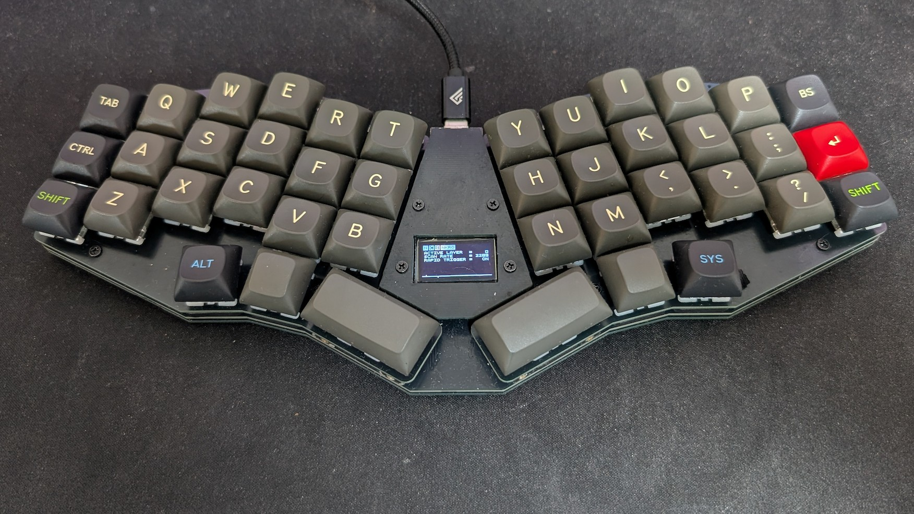
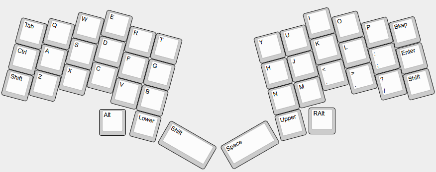

# TrueStrike42

TrueStrike42 is a columnar staggered unibody split Hall-effect keyboard designed to maximize performance[^1] and minimize finger fatigue.

[^1]: specifically on rhythm games

# Layout

# How to build
Refer to the [build guide](doc/buildguide.md) for detailed instructions.

# Firmware
## Use Precompiled Binary
Flash `fw/truestrike42_via.uf2` to your RP2040 microcontroller in bootloader mode.

## Build on Your Own
### Option A
Copy the `fw/truestrike42` folder into your cloned QMK Firmware repository's `keyboards` folder, then run `qmk compile -kb truestrike42 -km via`.

### Option B
- [QMK Firmware fork](https://github.com/byungyoonc/qmk_firmware/tree/Truestrike42)
- [VIA QMK Userspace fork](https://github.com/byungyoonc/qmk_userspace_via/tree/truestrike42)

The branches above are from my fork of the QMK Firmware/Userspace repository which supports firmware compilation for TrueStrike42. 

Follow [this guide for External QMK Userspace](https://docs.qmk.fm/newbs_external_userspace) to build it yourself.

# Using VIA HE Configurations
You can access the following tools in VIA by selecting **HE TOOLS** in the menu next to **LIGHTING**.

## Load VIA Definition
Open `fw/truestrike42.json` in VIA's **DESIGN** tab to enable VIA support for TrueStrike42.

## Calibrations
**Make sure to run the calibration at least once before using the keyboard!**
### Bottoming Calibration
Calibrates Hall-effect sensor values for each switch when it is fully bottomed out.

Toggle on, fully bottom out each switch, then toggle off.

### Noise Floor Calibration
Calibrates the ambient magnetic flux fluctuation detected by the Hall-effect sensors.

Click once while leaving the keyboard untouched for a brief period. The firmware samples the noise baseline.

### Show Calibration Data
Prints out current calibration data to the debug console.

### Clear Bottoming Calibration Data
Resets Bottoming Calibration Data to prepare for recalibration. Use this when replacing your Hall-effect switches.

## Actuation
### Mode
Choose between APC and Rapid Trigger.

APC works like a traditional digital switch, but you can change where actuation/release occurs.

Rapid Trigger tracks the switch's height to determine whether the key is being pressed down or released.

### Offsets
Sets the offset values for the selected Mode.

The value ranges from 1 (Topmost) to 255 (Bottommost).

# Copyright Notice
`True-Strike-icon.kicad_mod` was created by modifying an icon image for True Strike in the game Baldur's Gate 3, a game by Larian Studios. I used it in accordance with the [Larian Fan Content Policy](https://larian.com/fan-content-policy).