# Build Guide for TrueStrike42
## BOM (Bill of Material)
### Required
| Name | Count | Notes |
| ---- | ----- | ---------- |
| Main board PCB | x1 | |
| MCU Cover | x1 | |
| Bottom Plate | x1 | |
| Top Plate | x2 | Use one for each side, one of them flipped |
| Hall-effect sensor in SOT-23-3 package | x42 | e.g. SLSS49e, GH39FKSW |
| 0.1uF~1uF Capacitors in 0805 SMD package | x58 | e.g. CL21B124KAC |
| 74HC4051 in SOIC-16 package | x7 | 8-channel analog multiplexer |
| 4053 in SOIC-16 package | x1 | Triple 2-channel analog multiplexer |
| 74AHCT125 in SOIC-14 package | x1 | 3V-5V level shifter |
| SMD Tact Switch (6.0x3.5mm) | x1 | Reset button |
| RP2040 dev board with ProMicro compatible pinouts | x1 | Uses A0 through A3 as analog input pins |
| M2 4mm bolts | x24 | Preferably flat-headed |
| M2 7~8mm standoff | x12 | You might need longer ones for the MCU cover, depending on what pin sockets/headers you're using |

### Optional
| Name | Count | Notes |
| ---- | ----- | ---------- |
| 128x64 OLED Screen | x1 | e.g. SSD1306 |
| SK6812MINI-E | x42 | Per-key RGB Matrix |
| MCU Pin Sockets | x2 (12pins) | Makes MCU to be detached easier when things go south |
| MCU Pin Headers | x2 (12pins) | Can be replaced with through-hole diode legs |

### Not Included in CAD, Required for the Use
| Name | Count | Notes |
| ---- | ----- | ---------- |
| N-pole bottom magnetic keyboard switches | x42 | Any Wooting-compatible switches will work |
| Keycaps | x42 | Ones that fit your switches, likely MX stem compatible |
| Bumpons | x4~8 | Small bumpons with adhesive will do |
| 2u stabilizers | x2 | (Optional) |
| USB-C cable | x1 | |

## Soldering Components
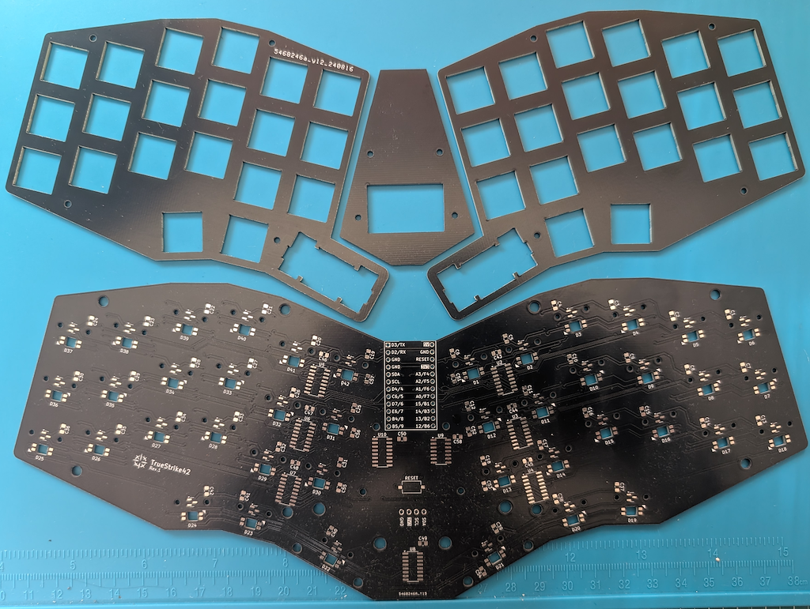

Get your PCB and plates ready, and solder the components on the PCB.

> [!NOTE]
> MCU's bootloader mode buttons can be very hard to access after all the soldering, so consider flashing the firmware beforehand.

> [!WARNING]
> MCU will behave very erratic (e.g. sending random keypresses rapidly) right after flashing the firmware, before soldering all the components on the board. This is because MCU's analogue pins are connected to nothing, resulting in noise sensor values. 
>
> Disconnect the MCU from the PC as soon as possible after the successful firmware flash to prevent chaos.

After the soldering, back of the PCB will look like this:

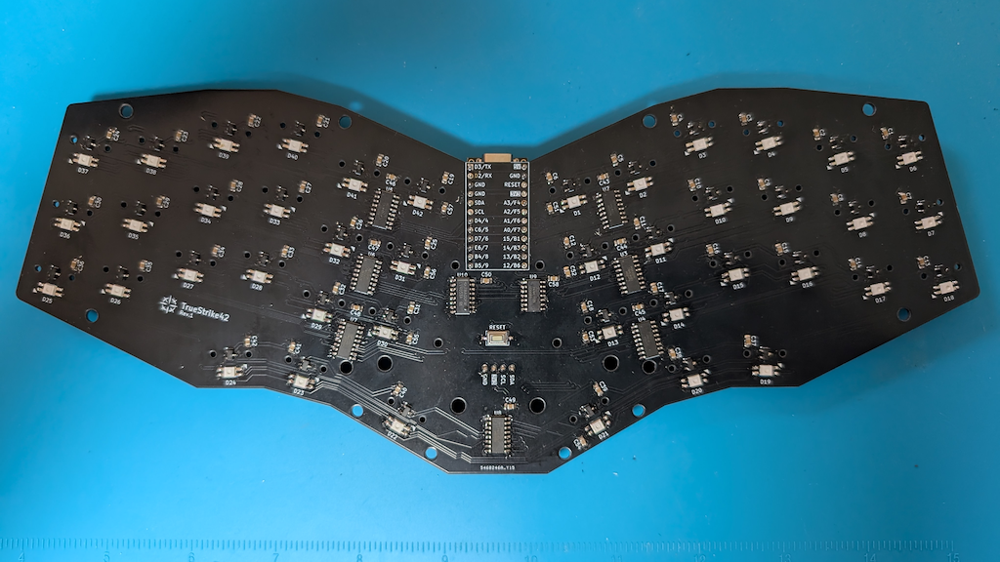

> [!NOTE]
> While soldering the components, make sure you're soldering the right component to the right position. Especially those ICs with SOIC packages can be tricky to identify; 
>
> - U2 through U8 uses 74HC4501
> - U9 uses 74AHCT125
> - U10 uses 4503.

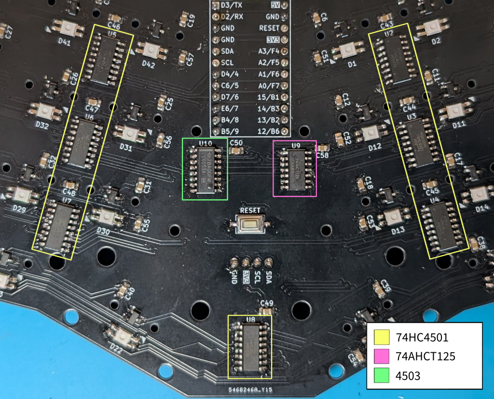

## Assembly

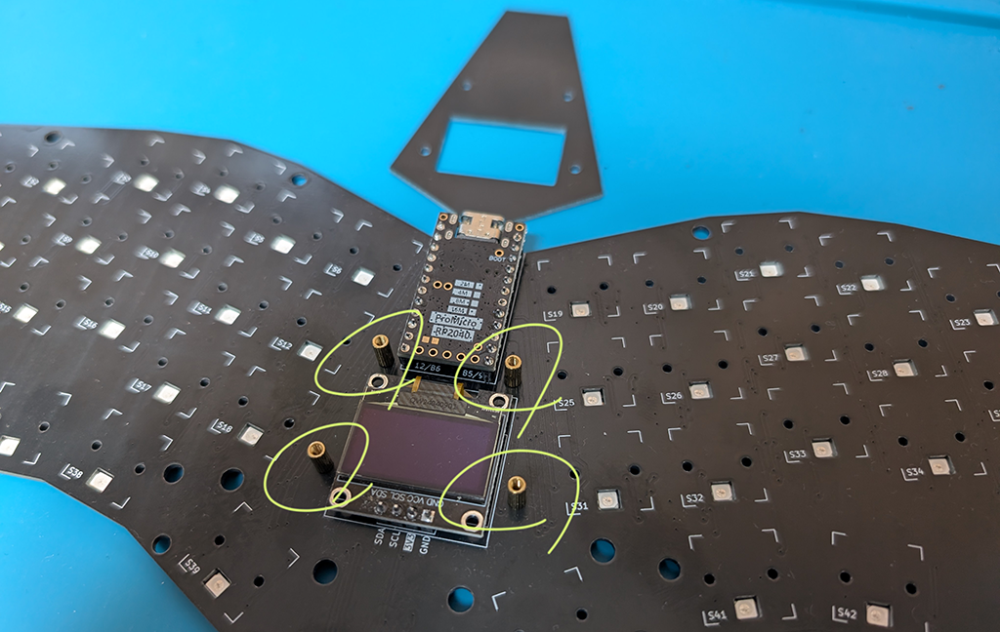

Lock 4 standoffs in their place on the PCB first, 

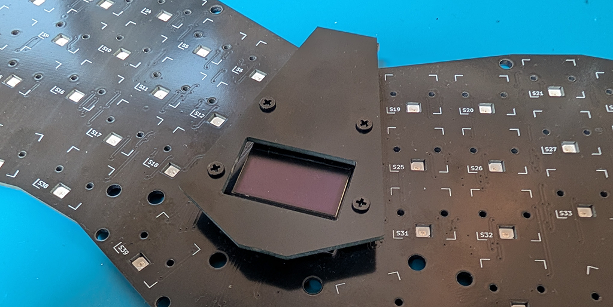

Then assemble the MCU cover.

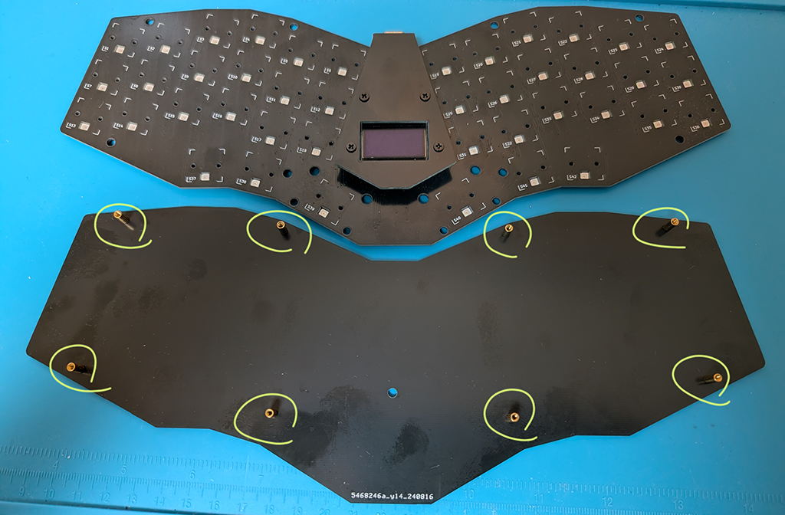

Same with the bottom plate. Lock 8 standoffs in their place first,

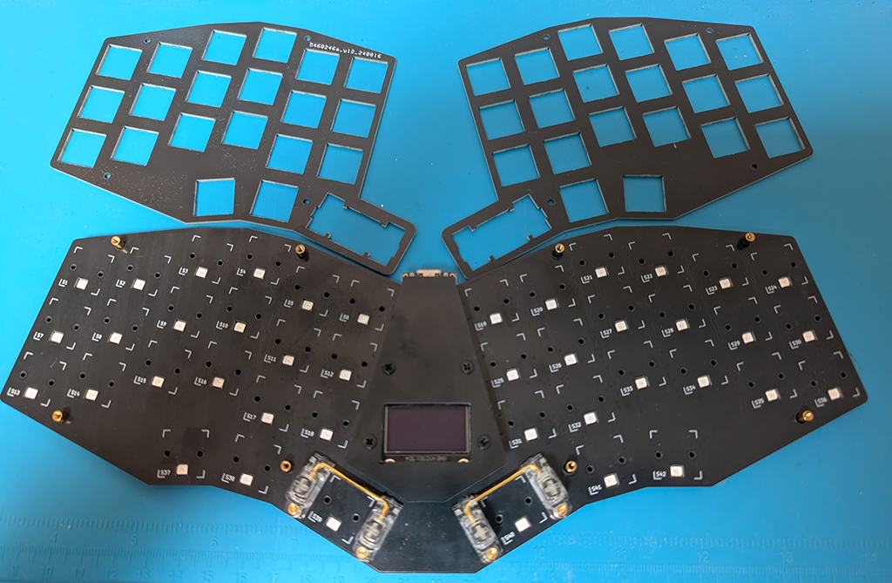

Put the PCB on top of the bottom plate, letting the standoffs go through slightly bigger holes punched in the PCB.

If you use stabilizers, install them here.

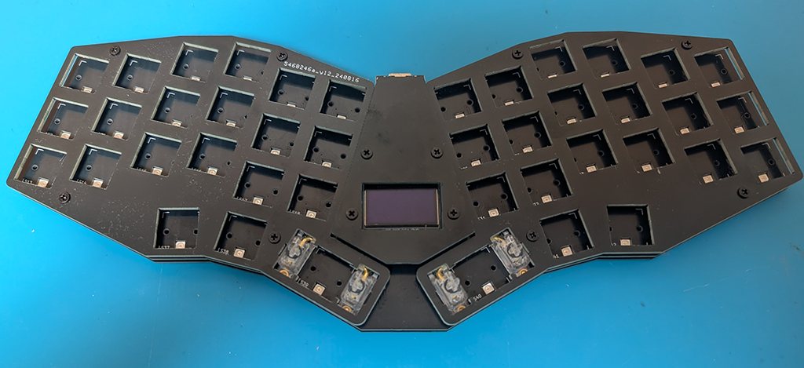

Assemble two top plates to complete the barebone build.

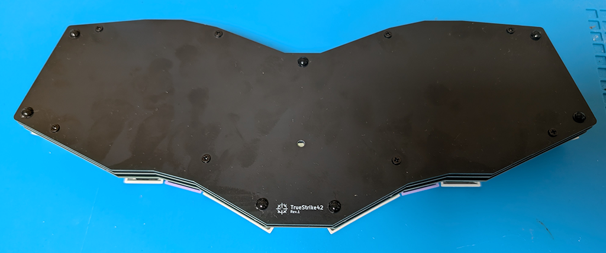

Flip the board and apply bumpons to prevent the keyboard from slipping around while typing.

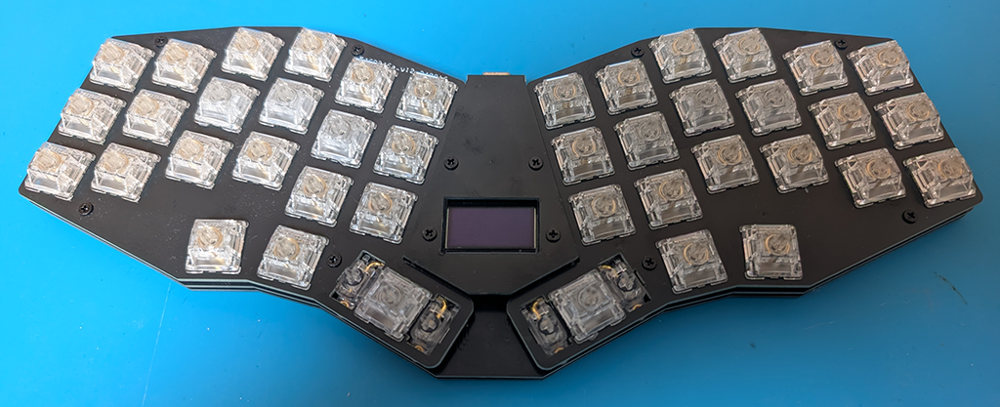

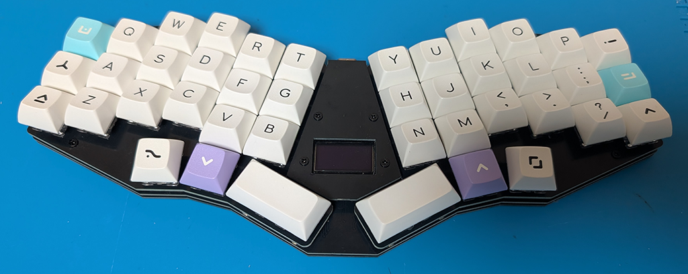

Install the switches and keycaps of your choice, [flash the firmware](../README.md#firmware), [go through the initial setup in VIA](../README.md#using-via-he-configurations) then enjoy the board!